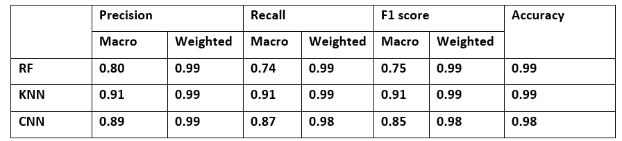

**Network Intrusion Detection Classification System**

**Problem Statement**

The increasing incidences of cyber-attacks have brought the issue of cyber security as regards Internet networks to the fore. In order to detect anomaly or misused detection, Intrusion Detection System (IDS) has been proposed as an important component of a secure network. Because of their mainly model free properties that enable them to identify the network pattern and discover whether they are normal or malicious, Machine learning techniques have become prevalent in the area of intrusion detection. Different types of machine learning models have been leveraged in anomaly-based IDS. Timely identification and classification of attacks allows the Security Engineer to appropriately deploy tools to counter such attacks.

**Approach**

The aim of this project is to identify a diverse set of attack scenarios and classify the network type into a benign (normal) or a form of attack (13 different classes of attacks) are identified. The project employs traditional machine learning models and deep learning approaches to identify the best way to classify the Intrusion detection.

**Dataset**

The Dataset used is the CICIDS2017 Dataset which can be downloaded from this address https://www.unb.ca/cic/datasets/ids-2017.html . This dataset built the abstract behavior of 25 users based on the HTTP, HTTPS, FTP, SSH, and email protocols. The dataset consists of CSV files for flow records generated with CICFlowMeter, and the sniffed network traffic PCAP files. Traffic Data captured for a total of five days. The data capturing period started at 9 a.m., Monday, July 3, 2017 and ended at 5 p.m. on Friday July 7, 2017, for a total of 5 days. Monday is the normal day and only includes the benign traffic. The implemented attacks include Brute Force FTP, Brute Force SSH, DoS, Heartbleed, Web Attack, Infiltration, Botnet and DDoS. They have been executed both morning and afternoon on Tuesday, Wednesday, Thursday and Friday. It involves labeled network flows comprising full packet payloads in PCAP format, the corresponding profiles and the labeled flows (GeneratedLabelledFlows.zip), and CSV files for machine learning.

**Feature Engineering**

We combined all the data from the individual days into a single CSV file. The approach of this project is classify all the normal and intrusion detection classes using one model as against several individual models focused on individual attack types. After initial cleaning up of the data, we identified the best feature set for detecting the kind of attack from 80 extracted feature. To achieve this we used RandomForestRegressor class of scikit-learn for feature importance. Many records for one class make the machine-learning model biased to that class, while little records make the machine-learning model learn nothing about that class. To solve the problem of imbalance, we used SMOTE (Synthetic Minority Oversampling Technique) to upsample the minority classes and enhance the sensitivity of arrangement for minority classes.

**Modeling**

We employed two tree based algorithms (KNN and Random Forest).

We also performed hyper parameter optimization for the chosen K-Nearest Neighbors (KNN), Random Forest (RF).

**CNN**

Traditional intrusion detection systems are no longer considered adequate to handle these advanced attacks with unexpected patterns. Attackers bypass known signatures and pretend to be normal users. Deep learning is an alternative to solving these issues. Deep Learning (DL)-based intrusion detection does not require a lot of attack signatures or the list of normal behaviors to generate detection rules. DL defines anomaly features by itself through training empirical data. 2D-CNNs are normally applied to image processing tasks such as image classification, face identification, pattern recognition. We have applied a 1D-CNN architecture to the problem of intrusion detection using a simple sequential model in Keras. To prevent overfitting we have used max polling layer and a dropout layer to provide regularization.

**Results**

**Model deployment**

To serve the model we have used a simple flask application in the app.py file. The model can be deployed locally. However we have chosen to deploy the model on a Paperspace platform and expose the API to API calls.

**Deployment to Paperspace**

- A model.pkl file is generated from the chosen algorithm. In this case the KNN algorithm.
- The model.pkl is uploaded to the persistent storage (/storage folder) using a Notebook or SSSH. This allows all experiments and jobs to have access to the model.pkl file.
- A new gradient job is created using the Gradient CLI or GUI interface:

Gradient CLI command:

- This spins up a new job and runs the app.py file and serves the api endpoint on port 8080.
- Using the URL obtained from the environment section of the paperspace job. Curl request can be made to the API.
- Sample curl request : curl jvil4lv9zavch.gradient.paperspace.com:8080/predict\_api -d &quot;{\&quot;foo\&quot;: -0.438483, \&quot;fo1\&quot;:-0.03465627, \&quot;fo2\&quot;:-0.21685119, \&quot;fo3\&quot;:-0.38407917, \&quot;fo4\&quot;:-0.05712065, \&quot;fo5\&quot;:-0.18296035, \&quot;fo6\&quot;:-0.03466339, \&quot;fo7\&quot;:1.54589897, \&quot;fo8\&quot;:-0.21277228, \&quot;fo9\&quot;:0.00247815, \&quot;f10\&quot;:-0.35159079, \&quot;f11\&quot;:-0.33829696}&quot; -H &quot;Content-Type: application/json&quot;

(Please note this is from a Windows System, minor modifications in the curl command might be required for Linux OS)

- The API returns whether the request is a good (normal) traffic or if the request is an intrusion and displays the class of the intrusion.
- Log monitoring can be done on paperspace to monitor API requests sent to the server.

**COST**

The cost for the low cost C3 CPU instance is $0.018/hr.

**References**

Iman Sharafaldin, Arash Habibi Lashkari, and Ali A. Ghorbani, &quot;Toward Generating a New Intrusion Detection Dataset and Intrusion Traffic Characterization&quot;, 4th International Conference on Information Systems Security and Privacy (ICISSP), Portugal, January 2018
